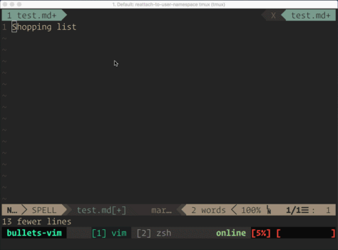
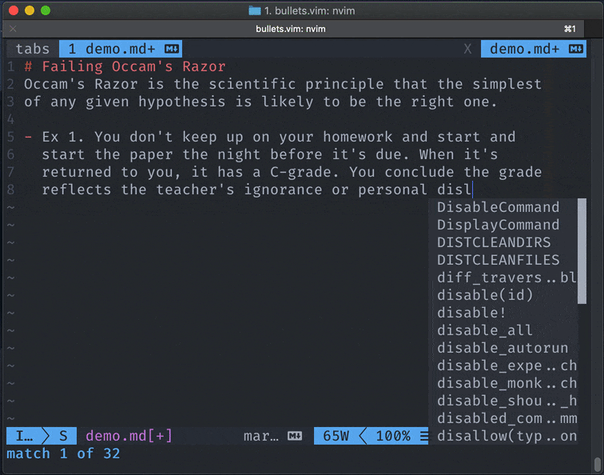
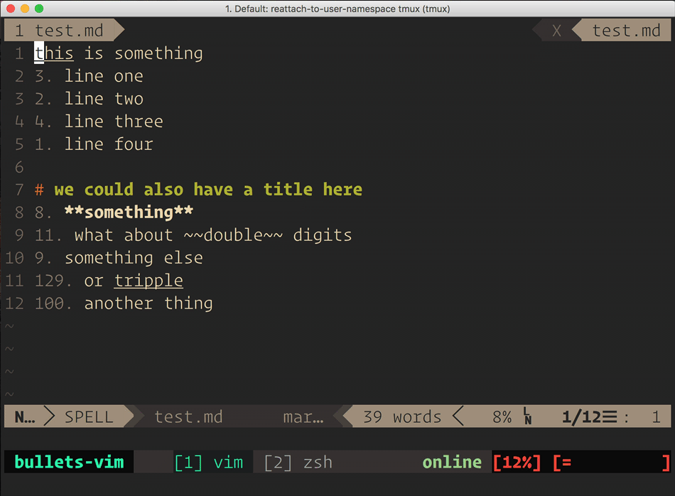

[](https://travis-ci.org/dkarter/bullets.vim) 

<!-- ALL-CONTRIBUTORS-BADGE:START - Do not remove or modify this section -->
[](#contributors-)
<!-- ALL-CONTRIBUTORS-BADGE:END -->

# Description

Bullets.vim is a Vim plugin for automated bullet lists.

Simple bullets:



Wrapped text bullets:


Renumbering lines:


# Installation

With VimPlug:

```vim
Plug 'dkarter/bullets.vim'
```

Then source your bundle file and run `:PlugInstall`.


# Usage

In markdown or a text file start a bulleted list using `-` or `*`. Press return
to go to the next line, a new list item will be created.

# Configuration

### Filetypes

You can choose which file types this plugin will work on:

```vim
" Bullets.vim
let g:bullets_enabled_file_types = [
    \ 'markdown',
    \ 'text',
    \ 'gitcommit',
    \ 'scratch'
    \]
```

You can disable this plugin for empty buffers (no filetype):

```vim
let g:bullets_enable_in_empty_buffers = 0 " default = 1
```

Enable/disable default key mappings:

```vim
let g:bullets_set_mappings = 0 " default = 1
```

Add a leader key before default mappings:

```vim
let g:bullets_mapping_leader = '<M-b>' " default = ''
```

Enable/disable deleting the last empty bullet when hitting `<cr>` (insert mode) or `o` (normal mode):

```vim
let g:bullets_delete_last_bullet_if_empty = 0 " default = 1
```

Line spacing between bullets (1 = no blank lines, 2 = one blank line, etc.):

```vim
let g:bullets_line_spacing = 2 " default = 1
```

Don't/add extra padding between the bullet and text when bullets are multiple characters long:

```vim
let g:bullets_pad_right = 1 " default = 1
" I. text
" II. text
" III. text
" IV.  text
" V.   text
"     ^ extra spaces to align the text with the longest bullet

let g:bullets_pad_right = 0
" I. text
" II. text
" III. text
" IV. text
"    ^ no extra space between bullet and text
```

Maximum number of alphabetic characters to use for bullets:

```vim
let g:bullets_max_alpha_characters = 2 " default = 2
" ...
" y. text
" z. text
" aa. text
" ab. text

let g:bullets_max_alpha_characters = 1
" ...
" y. text
" z. text
" text
```

Nested outline bullet levels:

```vim
let g:bullets_outline_levels = ['ROM', 'ABC', 'num', 'abc', 'rom', 'std-', 'std*', 'std+'] " default
" Ordered list containing the heirarchical bullet levels, starting from the outer most level.
" Available bullet level options (cannot use the same marker more than once)
" ROM/rom = upper/lower case Roman numerals (e.g., I, II, III, IV)
" ABC/abc = upper/lower case alphabetic characters (e.g., A, B, C)
" std[-/*/+] = standard bullets using a hyphen (-), asterisk (*), or plus (+) as the marker.
" chk = checkbox (- [ ])

let g:bullets_outline_levels = ['num', 'abc', 'std-']
" Example [keys pressed to get this bullet]:
" 1. first parent
"   a. child bullet [ <cr><C-t> ]
"     - unordered bullet [ <cr><C-t> ]
"   b. second child bullet [ <cr><C-d> ]
" 2. second parent [ <cr><C-d> ]
```

Enable/disable automatically renumbering the current ordered bullet list when changing the indent level of bullets or inserting a new bullet:

```vim
let g:bullets_renumber_on_change = 1 " default = 1
" Example 1:
" 1. first existing bullet
"   a. second existing bullet [ hit <C-t> ]
" 2. third existing bullet [ this got renumbered 3 -> 2 when bullet 2 got demoted ]
"
" Example 2:
" 1. first existing bullet
" 2. second existing bullet [ use <cr>/o to add a new bullet below this ]
" 3. new bullet
" 4. third existing bullet [ this got renumbered 3 -> 2 when bullet 2 got demoted ]

let g:bullets_renumber_on_change = 0
" Example:
" 1. first existing bullet
"   a. second existing bullet [ hit <C-t> ]
" 3. third existing bullet [ no renumbering so this bullet remained `3` ]
"
" Example 2:
" 1. first existing bullet
" 2. second existing bullet [ use <cr>/o to add a new bullet below this ]
" 3. new bullet
" 3. third existing bullet [ no renumbering so this bullet remained `3` ]
```

Enable/disable toggling parent and child checkboxes to indicate "completion" of child checkboxes:

```vim
let g:bullets_nested_checkboxes = 1 " default = 1
" Example:
" - [ ] first bullet
"   - [ ] child bullet  [ type <leader>x ]
"     - [ ] sub-child
"   - [ ] child bullet
" 
" Result:
" - [o] first bullet   [ <- indicates partial completion of sub-tasks ]
"   - [X] child bullet
"     - [X] sub-child  [ <- children get checked when parents get checked ]
"   - [ ] child bullet
```

Define the checkbox markers to use to indicate unchecked, checked, and "partially" checked. When only two marker characters are defined, the use of partial completion markers will be disabled. If more than two markers are defined, each character between the first and last characters will be used to indicate a percentage of the child checkboxes that are checked. Each marker corresponds to 1/n, where n is the number of partial completion markers. By default, there are three partial completion markers, `.`, `o`, and `O`, corresponding to 33%, 66%, and up to but less than 100%, respectively. Note that unchecked (`[ ]`) and checked (`[x]` or `[X]`) statuses using the default markers are always valid, even if you set custom markers for unchecked and checked.

```vim
let g:bullets_checkbox_markers = ' .oOX'
" Example:
" - [o] parent bullet  [ <- `o` indicates 66% - 99% of children are checked ]
"   - [ ] child bullet
"   - [.] child bullet [ <- partial completions don't count as complete ]
"     - [ ] sub-child bullet [ <- 1/4 of children checked so parent is `.` ]
"     - [ ] sub-child bullet
"     - [ ] sub-child bullet
"     - [X] sub-child bullet
"   - [X] child bullet
"   - [X] child bullet
"
" You can use fancy markers:
" let g:bullets_checkbox_markers = '✗○◐●✓'
" - [✗] unchecked
" - [○] partial
"   - [✓] checked
"   - [✗] unchecked
"   - [✗] unchecked
"   - [✗] unchecked
```

Define whether toggling partially complete checkboxes sets the checkbox to checked or unchecked:

```vim
" Example 1:
let g:bullets_checkbox_partials_toggle = 1 " default = 1
" - [o] partially checked  [ type <leader>x ]
"   - [x] sub bullet
"   - [ ] sub bullet
" 
" Result:
" - [x] checked
"   - [x] sub bullet
"   - [x] sub bullet
" 
" Example 2:
let g:bullets_checkbox_partials_toggle = 0
" - [o] partially checked  [ type <leader>x ]
"   - [x] sub bullet
"   - [ ] sub bullet
" 
" Result:
" - [ ] checked
"   - [ ] sub bullet
"   - [ ] sub bullet
```

# Mappings

* Insert new bullet in INSERT mode: `<cr>` (Return key)
* Same as <cr> in case you want to unmap <cr> in INSERT mode (compatibility depends on your terminal emulator): `<C-cr>`
* Insert new bullet in NORMAL mode: `o`
* Renumber current visual selection: `gN`
* Renumber entire bullet list containing the cursor in NORMAL mode: gN
* Toggle a checkbox in NORMAL mode: `<leader>x`
* Demote a bullet (indent it, decrease bullet level, and make it a child of the previous bullet):
  + NORMAL mode: `>>`
  + INSERT mode: `<C-t>`
  + VISUAL mode: `>`
* Promote a bullet (unindent it and increase the bullet level):
  + NORMAL mode: `<<`
  + INSERT mode: `<C-d>`
  + VISUAL mode: `>`

Disable default mappings:

```vim
let g:bullets_set_mappings = 0
```

Add a leader key before default mappings:

```vim
let g:bullets_mapping_leader = '<M-b>' 
" Set <M-b> to the leader before all default mappings:
" Example: renumbering becomes `<M-b>gN` instead of just `gN`
```

Just add above to your .vimrc

# Documentation

```
:h bullets
```

# Testing

The test suite is written using vimrunner. It is known to run on macOS with MacVim installed, and on travis. Your vim must have `+clientserver` and either have its own GUI or in a virtual X11 window.

On your mac run:

```sh
bundle install
bundle exec rspec
```

On linux:

```sh
bundle install
xvfb-run bundle exec rspec
```

You should see a Vim window open which will run each test, same general idea as
Capybara integration testing. ❤️

# TODO

- [x] eliminate trailing bullet on previous line if user pressed <cr> twice
- [x] allow indenting while in insert mode (C-l: indent right, C-h: indent left)
- [x] scope the keybindings and functions to markdown and perhaps text
- [x] allow GFM-style checkbox auto bullet
- [x] prefix shortcuts and allow disabling them
- [x] add numbered list
- [x] reset numbers (user selects numbered bullets 3-5 and copies to middle of document, then reselects and resets them to 1-3)
- [x] check if plugin initialized and don't load if it did
- [x] allow <C-cr> for return without creating a bullet (only possible in GuiVim
  unfortunately)
- [x] check if user is at EOL before appending auto-bullet - they may just want to
- [x] attempt to keep the same total bullet width even as number width varies (right padding)
- [x] detect lists that have multiline bullets (should have no empty lines between
  lines).
- [x] add alphabetic list
- [x] support for intelligent alphanumeric indented bullets e.g. 1. \t a. \t 1.
- [x] change nested outline levels in visual mode
- [x] support renumbering of alphabetical, roman numerals, and nested lists
- [x] update documentation for nested bullets
- [x] support nested bullets with child and partial completion
- [ ] support for nested numerical bullets, e.g., 1. -> 1.1 -> 1.1.1, 1.1.2
- [ ] add option to turn non-bullet lines into new bullets with `<C-t>`/`>>`/`>`

---

### About

[](https://hashrocket.com)

Bullets.vim is kindly supported by [Hashrocket, a multidisciplinary design and
development consultancy](https://hashrocket.com). If you'd like to [work with
us](https://hashrocket.com/contact-us/hire-us) or [join our
team](https://hashrocket.com/contact-us/jobs), don't hesitate to get in touch.

## Contributors ✨

Thanks goes to these wonderful people ([emoji key](https://allcontributors.org/docs/en/emoji-key)):

<!-- ALL-CONTRIBUTORS-LIST:START - Do not remove or modify this section -->
<!-- prettier-ignore-start -->
<!-- markdownlint-disable -->
<table>
  <tr>
    <td align="center"><a href="https://doriankarter.com"><br /><sub><b>Dorian Karter</b></sub></a><br /><a href="https://github.com/dkarter/bullets.vim/commits?author=dkarter" title="Code">💻</a> <a href="https://github.com/dkarter/bullets.vim/commits?author=dkarter" title="Tests">⚠️</a> <a href="https://github.com/dkarter/bullets.vim/commits?author=dkarter" title="Documentation">📖</a> <a href="#maintenance-dkarter" title="Maintenance">🚧</a></td>
    <td align="center"><a href="https://github.com/cormacrelf"><br /><sub><b>Cormac Relf</b></sub></a><br /><a href="https://github.com/dkarter/bullets.vim/commits?author=cormacrelf" title="Code">💻</a> <a href="https://github.com/dkarter/bullets.vim/issues?q=author%3Acormacrelf" title="Bug reports">🐛</a></td>
    <td align="center"><a href="http://keithmiyake.info"><br /><sub><b>Keith Miyake</b></sub></a><br /><a href="https://github.com/dkarter/bullets.vim/commits?author=kaymmm" title="Code">💻</a> <a href="https://github.com/dkarter/bullets.vim/commits?author=kaymmm" title="Documentation">📖</a> <a href="#ideas-kaymmm" title="Ideas, Planning, & Feedback">🤔</a> <a href="#maintenance-kaymmm" title="Maintenance">🚧</a></td>
    <td align="center"><a href="https://yous.be"><br /><sub><b>Chayoung You</b></sub></a><br /><a href="https://github.com/dkarter/bullets.vim/commits?author=yous" title="Code">💻</a> <a href="https://github.com/dkarter/bullets.vim/commits?author=yous" title="Documentation">📖</a></td>
    <td align="center"><a href="https://github.com/adriaanzon"><br /><sub><b>Adriaan Zonnenberg</b></sub></a><br /><a href="https://github.com/dkarter/bullets.vim/commits?author=adriaanzon" title="Code">💻</a></td>
    <td align="center"><a href="https://github.com/eater"><br /><sub><b>eater</b></sub></a><br /><a href="https://github.com/dkarter/bullets.vim/commits?author=eater" title="Code">💻</a></td>
    <td align="center"><a href="https://github.com/hut"><br /><sub><b>hut</b></sub></a><br /><a href="https://github.com/dkarter/bullets.vim/commits?author=hut" title="Code">💻</a> <a href="https://github.com/dkarter/bullets.vim/commits?author=hut" title="Documentation">📖</a></td>
  </tr>
  <tr>
    <td align="center"><a href="https://github.com/mykoza"><br /><sub><b>mykoza</b></sub></a><br /><a href="https://github.com/dkarter/bullets.vim/commits?author=mykoza" title="Code">💻</a> <a href="#ideas-mykoza" title="Ideas, Planning, & Feedback">🤔</a></td>
    <td align="center"><a href="https://github.com/noodlor"><br /><sub><b>noodlor</b></sub></a><br /><a href="https://github.com/dkarter/bullets.vim/commits?author=noodlor" title="Code">💻</a></td>
    <td align="center"><a href="https://github.com/harshad1"><br /><sub><b>Harshad Srinivasan</b></sub></a><br /><a href="https://github.com/dkarter/bullets.vim/commits?author=harshad1" title="Code">💻</a> <a href="https://github.com/dkarter/bullets.vim/issues?q=author%3Aharshad1" title="Bug reports">🐛</a></td>
    <td align="center"><a href="https://erickchacon.github.io/"><br /><sub><b>Erick A. Chacón Montalván</b></sub></a><br /><a href="#ideas-ErickChacon" title="Ideas, Planning, & Feedback">🤔</a></td>
    <td align="center"><a href="https://samgriesemer.com"><br /><sub><b>Sam Griesemer</b></sub></a><br /><a href="https://github.com/dkarter/bullets.vim/commits?author=samgriesemer" title="Code">💻</a> <a href="https://github.com/dkarter/bullets.vim/issues?q=author%3Asamgriesemer" title="Bug reports">🐛</a></td>
    <td align="center"><a href="https://codeberg.org/cpence"><br /><sub><b>Charles Pence</b></sub></a><br /><a href="https://github.com/dkarter/bullets.vim/commits?author=cpence" title="Code">💻</a></td>
    <td align="center"><a href="https://github.com/mstojanovic"><br /><sub><b>Marko Stojanovic</b></sub></a><br /><a href="https://github.com/dkarter/bullets.vim/commits?author=mstojanovic" title="Documentation">📖</a></td>
  </tr>
</table>

<!-- markdownlint-restore -->
<!-- prettier-ignore-end -->

<!-- ALL-CONTRIBUTORS-LIST:END -->

This project follows the [all-contributors](https://github.com/all-contributors/all-contributors) specification. Contributions of any kind welcome!
